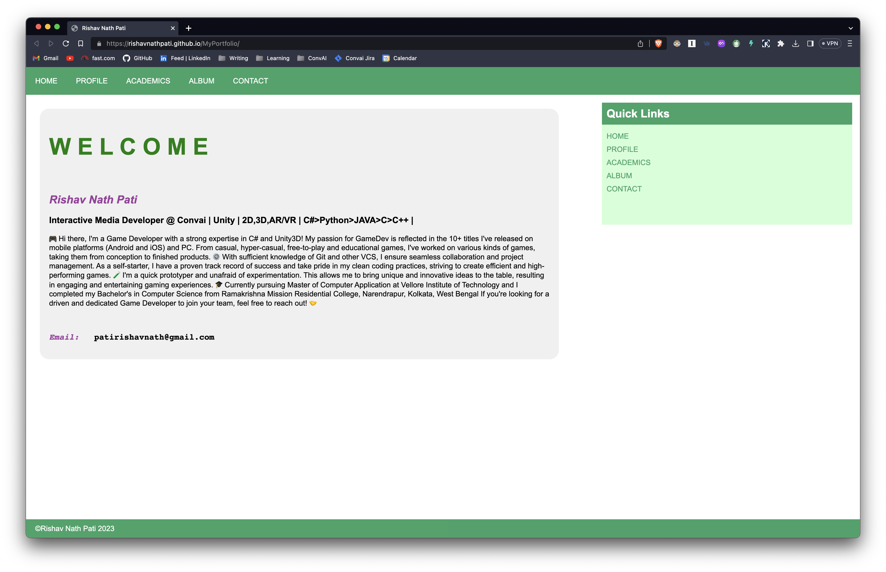
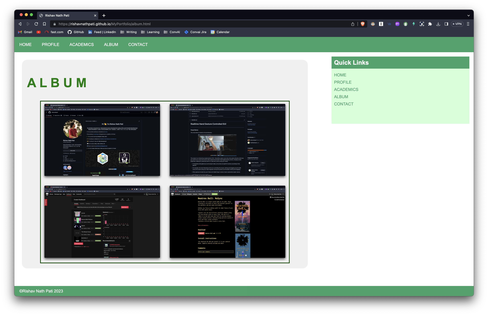
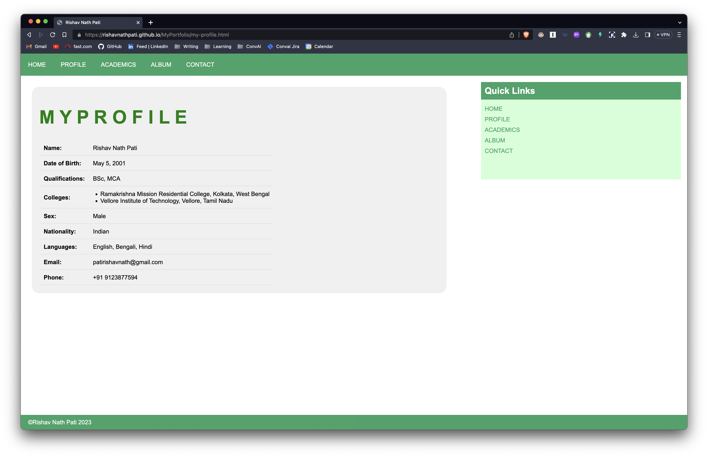

# A Portfolio

Themed Personal Portfolio Website

## Introduction

This project is a personal portfolio website built with HTML, CSS, and JavaScript. The purpose of this website is nothing much, just needed to host the website for an assignment. The website follows a generally green theme (because my prof wanted geen, not that I like it), using various shades and gradients of green to create an eye-catching design(dont think so at all).
<br><br>Rest of this part is complete bluff written by ChatGPT and I really do not feel like changing anything, its not gonna help anyone anyway. 

## Features

- Green-themed design with gradients and variations of green colors.
- Responsive layout that adapts to different screen sizes, including mobile devices.
- Navigation bar for easy access to different sections of the website.
- Quick links section for quick navigation to essential pages.
- About Me section to provide a brief introduction of the owner and their interests.
- Profile section with personal details, educational qualifications, and software skills.
- Album section with a grid layout to showcase images.

## Project Images




## Getting Started

### Prerequisites

To run the website locally, you need a modern web browser such as Google Chrome, Mozilla Firefox, or Microsoft Edge.

### Installation

1. Clone the repository to your local machine using the following command:

```
git clone https://github.com/rishavnathpati/MyPortfolio
```

2. Navigate to the project directory:

```
cd MyPortfolio-main
```

3. Open the `index.html` file in your web browser.

## Usage

- The navigation bar at the top of the page allows users to access different sections of the website.
- Clicking on the "PROFILE" link will take users to the "My Profile" section, which contains personal details, educational qualifications, and software skills.
- The "ALBUM" section displays a grid of images, showcasing the owner's work or interests.

## Contributing

If you'd like to contribute (please dont) to the project, follow these steps:

1. Fork the repository on GitHub.
2. Create a new branch with a descriptive name for your feature or bug fix.
3. Make your changes and commit them with clear commit messages.
4. Push your changes to your forked repository.
5. Create a pull request to merge your changes into the main repository.

## Contact

For any questions or feedback regarding the project, please feel free to reach out to the project maintainer:

- Name: Rishav Nath Pati
- Email: patirishavnath@gmail.com
